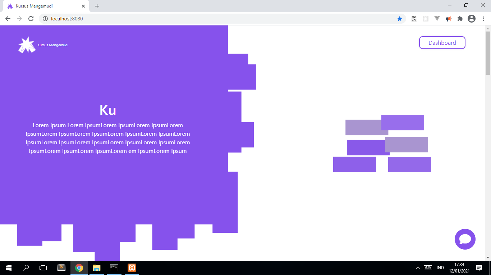
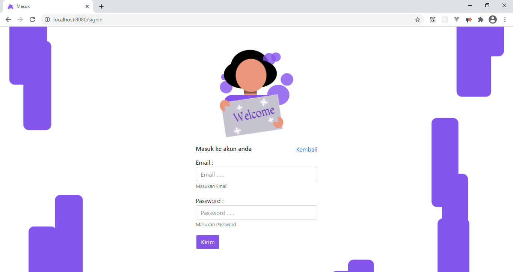
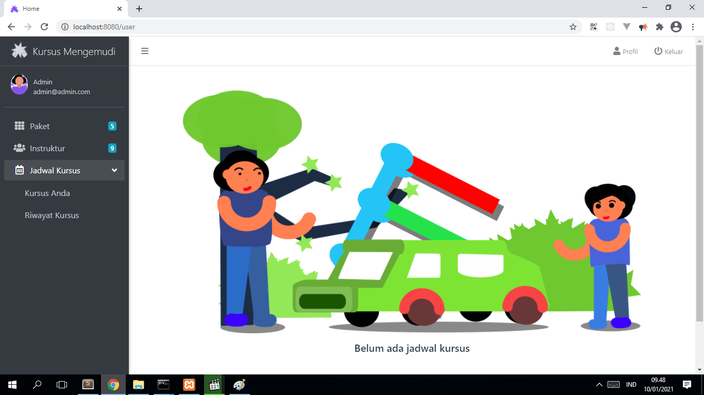
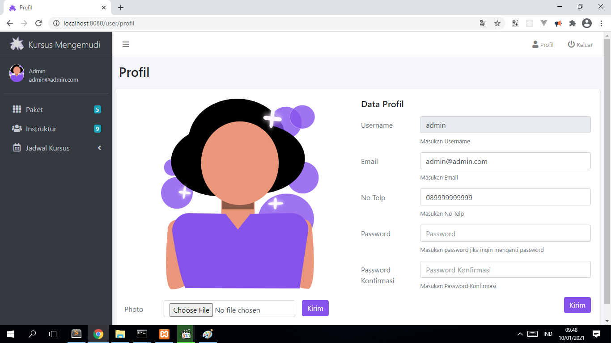
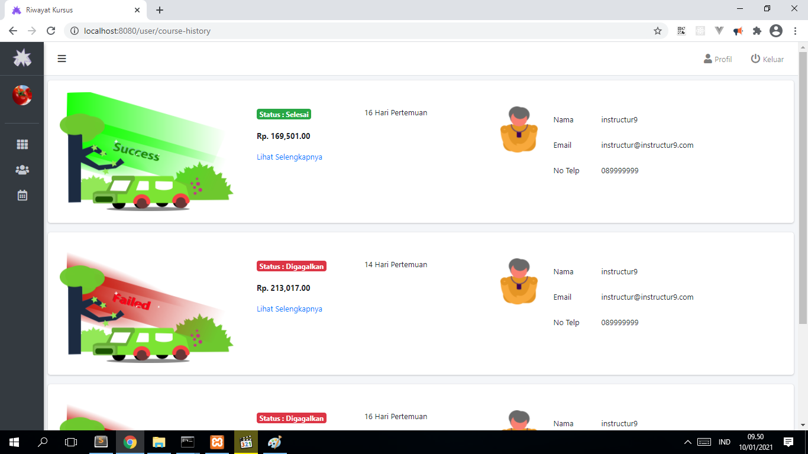
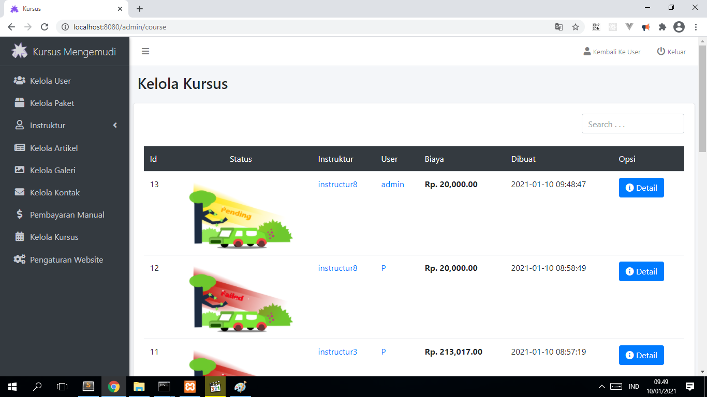

<h2> Sourcecode Management Kursus Mengemudi </h2>

  Dapat digunakan sebagai bahan refrensi belajar 
  dan juga referensi untuk tugas akhir

<h4> Halaman-halaman : </h4>

 <ul>
  <li>
    User  
    <ul>
      <li>halaman depan</li>
      <li>masuk</li>
      <li>daftar</li>
      <li>keluar</li>
      <li>profil</li>
      <li>halaman depan user login</li>
      <li>paket</li>
      <li>instruktur</li>
      <li>kursus anda</li>
      <li>riwayat kursus</li>
      <li>detail kursus</li>   
    </ul>      
  </li>
  <li>
    Admin  
    <ul>
      <li>halaman depan admin</li>
      <li>kelola artikel</li>
      <li>kelola galeri</li>
      <li>kelola user</li>
      <li>kelola kursus</li>
      <li>kelola paket</li>
      <li>kelola instruktur</li>
      <li>kelola pembayaran manual</li>
      <li>kelola website</li>
    </ul>
  </li>
 </ul>

<h4> Photo : </h4>

  
  
  
  
  
  

<h4> Requirement : </h4>

  <ul>
    <li>Php 7.2.0 ></li>
    <li>Composer 2.0.11 ></li>
    <li>Mysql</li>
    <li>Phpmyadmin (Optional)</li>
  </ul>

<h4> Alur : </h4>

  <a href="flow/README.md">Alur</a>

